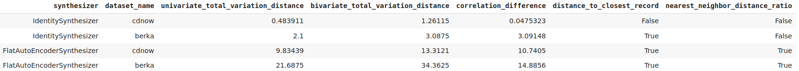
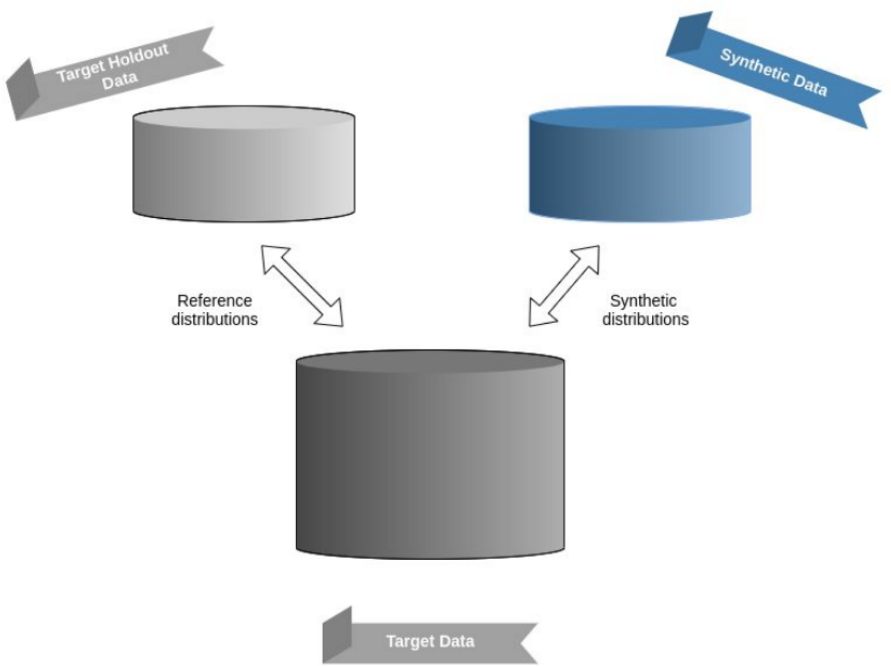
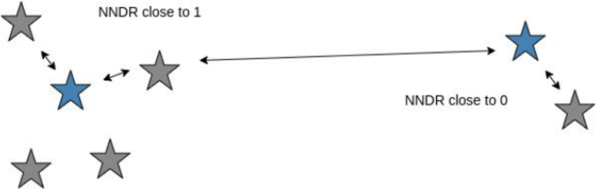

# `virtualdatalab` (VDL)

License: [GPLv3](https://github.com/mostly-ai/virtualdatalab/blob/master/LICENSE)

VDL is a framework to test drive generative models for sequential data w.r.t. to accuracy and privacy given a range 
of real-world and artificial datasets. Aside from measurement capabilities, synthesizers capable of sequential data generation are also included. 


## Install 
It is recommended to install`virtualdatalab` in a Conda virtual environment to avoid interfering with other software programs. 

```bash
# clone vdl
# will create conda env named vdl
conda create --name vdl
conda activate vdl
conda install pip
cd virtualdatalab/virtualdatalab
pip install -r requirements.txt
pip install . 
```


## Data Guidelines

### Input Data

Synthesizers and public functions accept only data formatted according to the following guideline. 


#### Common Data Format
* Pandas DataFrame
* `id` (denoting a subject) `sequence_pos` (order of sequences belonging to one subject) as index
* columns are either of type `numeric` or `categorical`
* single table (subject and sequence information is in single table)
* No NaN values. NaN values in categorical columns will be treated as the empty string ""

`target_data_manipulation.prepare_common_data_format` is a helper function to convert a given Pandas DataFrame or CSV into the  **common data format**.


### Output Data 

Synthesizers output data in the same format as input data. 

## Writing your own synthesizer class

All synthesizers must extend `synthesizes/base.py`. Additionally, `train` and `generate` must invoke 
parent method via `super()`. Parent functions ensure that **common data format** is respected and that models can not be 
expected to generate if they have not been trained yet. 

All synthesizer classes MUST accept the **common data format**. As a result, synthesizers are responsible for transformation of input data. 

`base.generate` calls `check_is_fitted`. This check looks for attributes with _ naming convention. All synthesizers must
declare training attributes with this style. 

```python
class MyGenerator(BaseSynthesizer):

    def train(self,data):
        super().train(data)
        data_model = some_transformation(data)
        self.train_data_ = data
        #  model is now trained
        self.data_model_ = data_model

    def generate(self,number_of_subjects):
        super().generate(self)
        generated_data = some_generation(number_of_subjects)
        
        return generated_data
```

## Useful Features

* **Data Processing**
    * Convert to Common Data Format 
        * `target_data_manipulation.prepare_common_data_format`
        * loads in a data source and prepares it to fit common data format
        * currently accepts `str` filepath to CSV or a Pandas DataFrame
        * data is assumed to be ordered within subject
       
* **Mock Data Generation && Datasets**
    * Mock Data Generator
        * `target_data_generate.generate_simple_seq_dummy`
        * numeric columns [0,1] uniform
        * categorical alphabet uniformly drawn
    * Selected real-word datasets
        * CDNOW - Online purchase for CDs
            * `virtualdatalab.datasets.loader.load_cdnow()`
            * 19'625 users with a sequence of 5 purchases
            * source: http://www.brucehardie.com/datasets/
        * BERKA - Retail bank transactions
            * `virtualdatalab.datasets.loader.load_berka()`
            * 44'000 users with a sequence of 10 transactions
            * source: https://data.world/lpetrocelli/czech-financial-dataset-real-anonymized-transactions
        * MLB - Batting statistics for MLB players
            * `virtualdatalab.datasets.loader.load_mlb()`
            * 4'000 baseball players with 8 recorded seasons
            * source: http://www.seanlahman.com/baseball-archive/statistics/
            * (c) 1996-2020 by Sean Lahman - http://creativecommons.org/licenses/by-sa/3.0/
        * RETAIL - Grocery retail orders and product items
            * `virtualdatalab.datasets.loader.load_retail()`
            * 10'000 users with a sequence of 100 ordered products

* **Included Synthesizers**
    * IdentitySynthesizer 
        * Returns a sample of the original data
    * ShuffleSynthesizer 
        * Returns a sample of the column-wise shuffled original data
    * FlatAutoEncoder
        * Encoder - Decoder Fully Connected NN in PyTorch

* **Metrics**
    * `metrics.compare`
        * given a target dataset and synthetic dataset, compute accuracy and privacy themed metrics (See [Metric Definitions](#metric-definitions))

* **Experimental Set-up**
    * `benchmark.benchmark` 
        * compute `metrics.compare` with many synthesizers across many datasets
        * if no datasets are passed then the default datasets are used (CDNOW + Berka)
    

## Metric Definitions
`benchmark` takes a simple combination of the metrics below to output one indicator per type.



### Accuracy

#### Frequency - Related Metrics

The frequency related metrics calculate the difference between target and synthetic data frequency distributions. 
To calculate the frequency, numeric variables are binned according to 10 quantiles. Categories are binned into 20 categories if cardinality exceeds 20. 

A perfect score is 0 which means that the synthetic data exactly matches the statistical correlations of target data.

* ##### Univariate Total Variation Distance
    * Measures frequencies with respect to one column.

* ##### Bivariate Total Variation Distance
    * Measures frequencies with respect to two columns.

* ##### Correlation Difference

    * Correlation is calculated using chi-square showing the association between two variables 

### Privacy


### Relative Distance
The main goal of these metrics is to measure the relative distance between individual synthetic data points to individual target data points. 

For each measure, a sample of the target dataset is drawn to be the holdout set. The remaining target dataset serves as a reference distribution. 
The relative distance privacy metrics compare the target data holdout set and a synthetic data holdout set of the same size to this reference distribution. 



* ##### Distance to Closest Records
    * Calculates the distance of each holdout set point to a point in the reference distribution. We aim to have the distribution not skewed to 0, as this would indicate there is no distance between synthetic and target.

* ##### Nearest Neighbour Distance Ratio
    * ratio of the closest and second closest point in the holdout set to a point in the reference distribution. An NNDR of 0 means that a given synthetic data point is only close to one point in the target, i.e an outlier. 
Thus the synthetic point is leaking information from the target data set. 


    
## Quick Start / Examples 
Collection of notebooks with examples.

* [identity_synthesizer_dummy.ipynb](useful_notebooks/identity_synthesizer_dummy.ipynb) 
[](https://colab.research.google.com/github/mostly-ai/virtualdatalab/blob/master/useful_notebooks/identity_synthesizer_dummy.ipynb) 
    * IdentitySynthesizer demo with Dummy Data  
*  [flatautoencoder_cdnow.ipynb](useful_notebooks/flatautoencoder_cdnow.ipynb) 
[](https://colab.research.google.com/github/mostly-ai/virtualdatalab/blob/master/useful_notebooks/flatautoencoder_cdnow.ipynb)
    * FlatAutoEncoder demo with CDNOW - accuracy
*  [benchmark_example.ipynb](useful_notebooks/benchmark_example.ipynb) 
[](https://colab.research.google.com/github/mostly-ai/virtualdatalab/blob/master/useful_notebooks/benchmark_example.ipynb)
    * Benchmark default settings: CDNOW + BERKA + MLB, IdentitySynthesizer + ShuffleSynthesizer + FlatAutoEncoder

## Google Colab Usage
Optional prerequisites:  
Google account - if interested in saving to drive. This is recommended, since datasets can be saved and loaded from Google Drive. 
Saving to Github is not possible if loading the notebook from Mostly AI public repo. 

Every new notebook launched will need to reinstall VDL each time. Add the following code snippet to your Google Colab notebooks. 

```python
"""
If running on Google Colab
"""

%mkdir vdl
%cd vdl
! git clone https://github.com/mostly-ai/virtualdatalab.git
%cd virtualdatalab/virtualdatalab
!pip install -r requirements.txt
!pip install .
```

References:  
[Using Google Colab with Github](https://colab.research.google.com/github/googlecolab/colabtools/blob/master/notebooks/colab-github-demo.ipynb#scrollTo=WzIRIt9d2huC)

