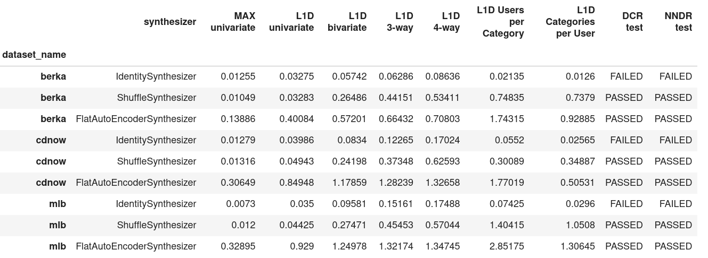

# Virtual Data Lab (VDL)

The Virtual Data Lab is a python-based framework to assess generative models for sequential data with respect to their *accuracy* as well as *privacy* given a range of real-world and machine-generated datasets. In addition, it contains basic synthesizers capable of sequential data generation. The DL-based generative models, developed by [MOSTLY AI](https://mostly.ai/) as part of their commercial offering, are not part of this package.

* License: [GPLv3](LICENSE)
* Development Status: Alpha

It is comparable to the [SDGym](https://github.com/sdv-dev/SDGym) by MIT, but differs in terms of its sole focus on sequential data, and its inclusion of privacy metrics.

## Installation

It is recommended to install `virtualdatalab` in a Conda virtual environment to avoid interfering with other software programs. 

```bash
# create conda env named `vdl`
conda create -y -n vdl python==3.7.7
conda activate vdl
conda install pip
cd virtualdatalab
pip install -r requirements.txt
# for cython extension
python setup.py build_ext --inplace 
pip install . 
```

## Data Requirements

Synthesizers and public functions accept only data formatted according to the following guideline. The generated data will adhere to that same format.

**common data format**:
* data resides within a single [pandas](https://pandas.pydata.org/) DataFrame
* DataFrame indexes: 
  * `id` - identifying a subject/person/indivudal
  * `sequence_pos` - order of sequences belonging to one subject
* DataFrame columns are either of type `numeric` or `categorical`
* No NaN values. NaN values in categorical columns will be treated as the empty string

The helper method `target_data_manipulation.prepare_common_data_format` can read in CSV files, and provides data in the required format.

## Features

* **Data Processing**
    * Convert to Common Data Format 
        * `target_data_manipulation.prepare_common_data_format`
        * loads in a data source and prepares it to fit common data format
        * currently accepts `str` filepath to CSV or a Pandas DataFrame
        * data is assumed to be ordered within subject
       
* **Mock Data Generation && Datasets**
    * Mock Data Generator
        * `target_data_generate.generate_simple_seq_dummy`
        * numeric columns [0,1] uniform
        * categorical alphabet uniformly drawn
    * Selected real-word datasets
        * CDNOW - Online purchase for CDs
            * `virtualdatalab.datasets.loader.load_cdnow()`
            * 19'625 users with a sequence of 5 purchases
            * source: http://www.brucehardie.com/datasets/
        * BERKA - Retail bank transactions
            * `virtualdatalab.datasets.loader.load_berka()`
            * 44'000 users with a sequence of 10 transactions
            * source: https://data.world/lpetrocelli/czech-financial-dataset-real-anonymized-transactions
        * MLB - Batting statistics for MLB players
            * `virtualdatalab.datasets.loader.load_mlb()`
            * 4'000 baseball players with 8 recorded seasons
            * source: http://www.seanlahman.com/baseball-archive/statistics/
            * (c) 1996-2020 by Sean Lahman - http://creativecommons.org/licenses/by-sa/3.0/
        * RETAIL - Grocery retail orders and product items
            * `virtualdatalab.datasets.loader.load_retail()`
            * 10'000 users with a sequence of 100 ordered products

* **Included Synthesizers**
    * IdentitySynthesizer 
        * Returns a sample of the original data
    * ShuffleSynthesizer 
        * Returns a sample of the column-wise shuffled original data
    * FlatAutoEncoder
        * Encoder - Decoder Fully Connected NN in PyTorch

* **Metrics**
    * `metrics.compare`
        * given a target dataset and synthetic dataset, compute accuracy and privacy themed metrics (See [Metric Definitions](#metric-definitions))

* **Experimental Set-up**
    * `benchmark.benchmark` 
        * compute `metrics.compare` with many synthesizers across many datasets
        * if no datasets are passed then the default datasets are used (CDNOW + Berka)
    

## Metric Definitions

`benchmark` takes a simple combination of the metrics below to output one indicator per type.



### Accuracy

#### Statistical Distance of Empirical Distributions

These metrics quantify the difference between the empirical distributions of the target compared to the synthetic data. Numeric variables are being discretized by binning these into 10 equally-spaced buckets. Categorical variables are considering the top 10 values, and lump together all remaining values into a single bucket.

First, for each subject a single event is randomly selected. Then,  for each column, resp each combination of 2, 3 or 4 columns the distance between empirical distribution is being calculated, and then averaged across a random subset of max. 100 of such combinations:
* [Total Variation Distance](https://en.wikipedia.org/wiki/Total_variation_distance_of_probability_measures) (TVD) = maximum deviation in relative frequency 
* [L1-Distance](https://en.wikipedia.org/wiki/Taxicab_geometry) (L1D) of empirical distributions = sum over all deviations in relative frequency

In addition, we calculate two coherence measures for each attribute over the sequence, and .
* L1-Distance for share of subjects per category
* L1-Distance for share of distinct categories per subject

The output from `metrics.compare` is 

| Metric Name             | Definition                                                                     |
|-------------------------|--------------------------------------------------------------------------------|
| TVD univariate          | The maximum relative frequency deviations with respect to 1 column.            |
| L1D univariate          | The sum of relative frequency deviations with respect to 1 column.             |
| L1D bivariate           | The sum of relative frequency deviations with respect to 2 columns.            |
| L1D 3-way               | The sum of relative frequency deviations with respect to 3 columns.            |
| L1D 4-way               | The sum of relative frequency deviations with respect to 4 columns.            |
| L1D Users per Category  | The sum of relative frequency deviations between how many users per category.  |
| L1D Categories per User | The sum of relative frequency deviations between how many categories per user. |

Bivariate, 3-way, 4-way are calculated even if original data contains less than 2,3,4 columns respectively. 

### Privacy

### Individual-Distance Tests

These metrics quantify the distance between individual synthetic data records to their closest target records. These distances are then related to the same distance measures applied to actual holdout data.


* Distance to Closest Records (DCR): Calculates the distance of each synthetic record to a record in the target distribution. These distances must not be systematically smaller than the distances between holdout and target.

* Nearest Neighbour Distance Ratio (NNDR): Ratio of the distance of each synthetic record to its closest to the second closest record in the target distribution. Again, these ratios should not be systematically smaller than the ratios derived for the holdout set. 


The output from `metrics.compare` is 
'DCR test': output is PASSED/FAILED depending on outcome of DCR test
'NNDR test': output is PASSED/FAILED depending on outcome of NNDR test
    
## Quick Start

Collection of notebooks with examples.

* [identity_synthesizer_dummy.ipynb](docs/notebooks/identity_synthesizer_dummy.ipynb) 
[](https://colab.research.google.com/github/mostly-ai/virtualdatalab/blob/master/docs/notebooks/identity_synthesizer_dummy.ipynb) 
    * IdentitySynthesizer demo with Dummy Data  
*  [flatautoencoder_cdnow.ipynb](docs/notebooks/flatautoencoder_cdnow.ipynb) 
[](https://colab.research.google.com/github/mostly-ai/virtualdatalab/blob/master/docs/notebooks/flatautoencoder_cdnow.ipynb)
    * FlatAutoEncoder demo with CDNOW - accuracy
*  [benchmark_example.ipynb](docs/notebooks/benchmark_example.ipynb) 
[](https://colab.research.google.com/github/mostly-ai/virtualdatalab/blob/master/docs/notebooks/benchmark_example.ipynb)
    * Benchmark default settings: CDNOW + BERKA + MLB, IdentitySynthesizer + ShuffleSynthesizer + FlatAutoEncoder

### Google Colab

These notebooks can be run locally, as well as on Google Colab.

Prerequisites for the later is a Google account, if you intend to save to Google Drive. Saving to Github is not possible if the notebook are loaded from the MOSTLY AI public GitHub repo.

Note, that every launched notebook will need to reinstall VDL each time. Add the following code snippet to your Google Colab notebooks to do so.

```python
"""
If running on Google Colab
"""

%mkdir vdl
%cd vdl
! git clone https://github.com/mostly-ai/virtualdatalab.git
%cd virtualdatalab/virtualdatalab
!pip install -r requirements.txt
!pip install .
```

References:  
[Using Google Colab with Github](https://colab.research.google.com/github/googlecolab/colabtools/blob/master/notebooks/colab-github-demo.ipynb#scrollTo=WzIRIt9d2huC)


## Writing your own synthesizer class

All synthesizers must extend `synthesizes/base.py`. Additionally, `train` and `generate` must invoke 
parent method via `super()`. Parent functions ensure that **common data format** is respected and that models can not be 
expected to generate if they have not been trained yet. 

All synthesizer classes MUST accept the **common data format**. As a result, synthesizers are responsible for transformation of input data. 

`base.generate` calls `check_is_fitted`. This check looks for attributes with _ naming convention. All synthesizers must
declare training attributes with this style. 

```python
class MyGenerator(BaseSynthesizer):

    def train(self,data):
        super().train(data)
        data_model = some_transformation(data)
        self.train_data_ = data
        #  model is now trained
        self.data_model_ = data_model

    def generate(self,number_of_subjects):
        super().generate(self)
        generated_data = some_generation(number_of_subjects)
        
        return generated_data
```
